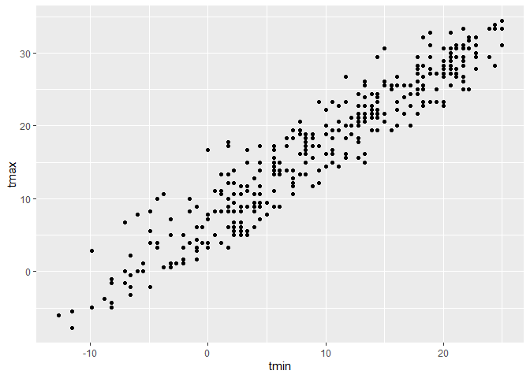
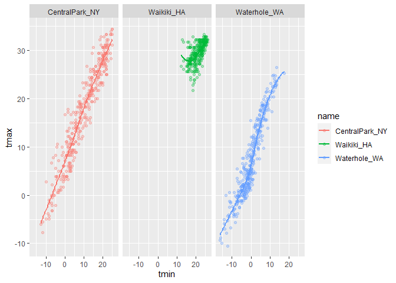
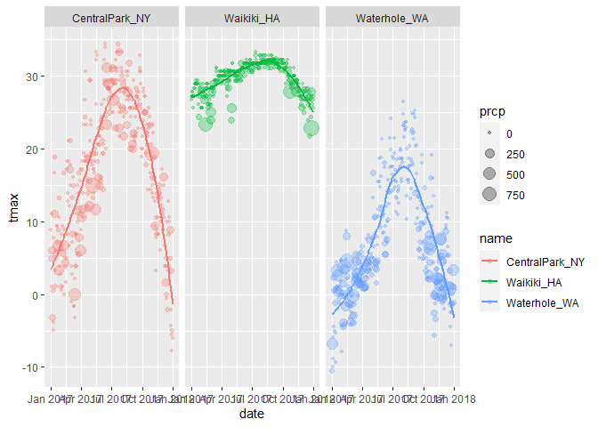
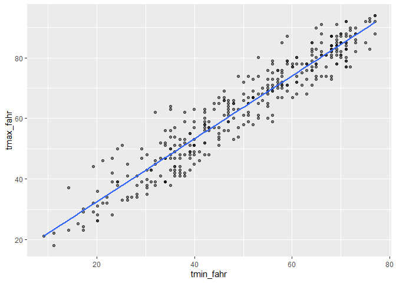
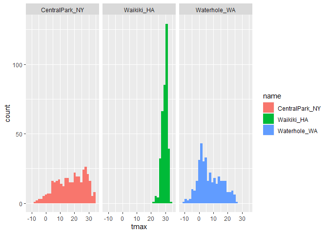
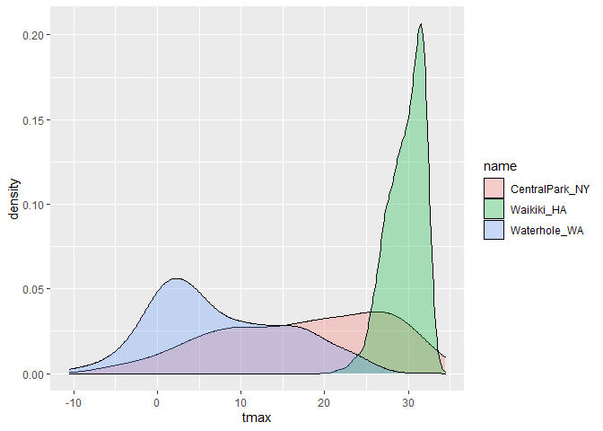

viz_part_1
================
Tim Hauser

## Import data

``` r
library(tidyverse)
```

    ## ── Attaching packages ─────────────────────────────────────── tidyverse 1.3.2 ──
    ## ✔ ggplot2 3.3.6      ✔ purrr   0.3.4 
    ## ✔ tibble  3.1.8      ✔ dplyr   1.0.10
    ## ✔ tidyr   1.2.0      ✔ stringr 1.4.1 
    ## ✔ readr   2.1.2      ✔ forcats 0.5.2 
    ## ── Conflicts ────────────────────────────────────────── tidyverse_conflicts() ──
    ## ✖ dplyr::filter() masks stats::filter()
    ## ✖ dplyr::lag()    masks stats::lag()

``` r
library(ggridges)
```

Copy in this code from course website:

``` r
weather_df = 
  rnoaa::meteo_pull_monitors(
    c("USW00094728", "USC00519397", "USS0023B17S"),
    var = c("PRCP", "TMIN", "TMAX"), 
    date_min = "2017-01-01",
    date_max = "2017-12-31") %>%
  mutate(
    name = recode(
      id, 
      USW00094728 = "CentralPark_NY", 
      USC00519397 = "Waikiki_HA",
      USS0023B17S = "Waterhole_WA"),
    tmin = tmin / 10,
    tmax = tmax / 10) %>%
  select(name, id, everything())
```

    ## Registered S3 method overwritten by 'hoardr':
    ##   method           from
    ##   print.cache_info httr

    ## using cached file: C:\Users\TIMHAU~1\AppData\Local/Cache/R/noaa_ghcnd/USW00094728.dly

    ## date created (size, mb): 2022-09-29 10:32:40 (8.418)

    ## file min/max dates: 1869-01-01 / 2022-09-30

    ## using cached file: C:\Users\TIMHAU~1\AppData\Local/Cache/R/noaa_ghcnd/USC00519397.dly

    ## date created (size, mb): 2022-09-29 10:32:51 (1.703)

    ## file min/max dates: 1965-01-01 / 2020-03-31

    ## using cached file: C:\Users\TIMHAU~1\AppData\Local/Cache/R/noaa_ghcnd/USS0023B17S.dly

    ## date created (size, mb): 2022-09-29 10:32:55 (0.952)

    ## file min/max dates: 1999-09-01 / 2022-09-30

Let’s make a scatterplot

``` r
ggplot(weather_df, aes(x = tmin, y = tmax)) + geom_point()
```

    ## Warning: Removed 15 rows containing missing values (geom_point).

<!-- -->

Let’s make the a similar scatterplot, but differently using piping (also
added a filter below)

``` r
weather_df %>%
  drop_na() %>% 
  filter(name == "CentralPark_NY") %>% 
  ggplot(aes(x = tmin, y = tmax)) + 
  geom_point()
```

<!-- -->

Let’s keep making the same plot but different

``` r
weather_scatterplot =
  weather_df %>% 
  drop_na() %>% 
  ggplot(aes(x = tmin, y = tmax))

weather_scatterplot + geom_point()
```

<!-- -->

## Let’s fancy this up a bit

Adding color + legend, a smooth curve

``` r
weather_df %>% 
  ggplot(aes(x = tmin, y = tmax)) + 
  geom_point(aes(color = name)) +
  geom_smooth()
```

    ## `geom_smooth()` using method = 'gam' and formula 'y ~ s(x, bs = "cs")'

    ## Warning: Removed 15 rows containing non-finite values (stat_smooth).

    ## Warning: Removed 15 rows containing missing values (geom_point).

<!-- -->

``` r
# here geom_smooth applies to whole
```

Same as above but this time smooth curve applied to each color, then
made points transparent and took out SE of smooth curve

``` r
weather_df %>% 
  ggplot(aes(x = tmin, y = tmax, color = name)) + 
  geom_point(alpha = 0.3) +
  geom_smooth(se = FALSE)
```

    ## `geom_smooth()` using method = 'loess' and formula 'y ~ x'

    ## Warning: Removed 15 rows containing non-finite values (stat_smooth).

    ## Warning: Removed 15 rows containing missing values (geom_point).

<!-- -->

``` r
# here geom_smooth applies to each color
```

Make separate panels separated by whatever variable we are interested in

``` r
weather_df %>% 
  ggplot(aes(x = tmin, y = tmax, color = name)) + 
  geom_point(alpha = 0.3) +
  geom_smooth(se = FALSE) +
  facet_grid(. ~ name)
```

    ## `geom_smooth()` using method = 'loess' and formula 'y ~ x'

    ## Warning: Removed 15 rows containing non-finite values (stat_smooth).

    ## Warning: Removed 15 rows containing missing values (geom_point).

<!-- -->

``` r
# row against columns instead add: facet_grid(. ~ name)
```

`tmax` vs. `tmin` is boring, let’s spice it up some

``` r
weather_df %>% 
  ggplot(aes(x = date, y = tmax, color = name)) + 
  geom_point(aes(size = prcp), alpha = .3) +
  geom_smooth(se = FALSE) + 
  facet_grid(. ~ name)
```

    ## `geom_smooth()` using method = 'loess' and formula 'y ~ x'

    ## Warning: Removed 3 rows containing non-finite values (stat_smooth).

    ## Warning: Removed 3 rows containing missing values (geom_point).

<!-- -->

``` r
# made size of dots according to prcp, i.e., added another layer of information
```

## Learning Assignment 1

``` r
weather_df %>% 
  filter(name == "CentralPark_NY") %>% 
  mutate(
    tmax_fahr = tmax * (9 / 5) + 32,
    tmin_fahr = tmin * (9 / 5) + 32) %>% 
  ggplot(aes(x = tmin_fahr, y = tmax_fahr)) +
  geom_point(alpha = .5) + 
  geom_smooth(method = "lm", se = FALSE)
```

    ## `geom_smooth()` using formula 'y ~ x'

<!-- -->

## Unvariate plots…

Histograms, barplots, boxplots, violins, …

Histogram:

``` r
weather_df %>% 
  ggplot(aes(x = tmax, fill=name)) + 
  geom_histogram() +
  facet_grid(. ~ name)
```

    ## `stat_bin()` using `bins = 30`. Pick better value with `binwidth`.

    ## Warning: Removed 3 rows containing non-finite values (stat_bin).

<!-- -->

``` r
# fill= works better with histograms instead of color=
# often it makes sense to put historams in different panels
```

Density plot:

``` r
weather_df %>% 
  ggplot(aes(x = tmax, fill=name)) + 
  geom_density(alpha=0.3)
```

    ## Warning: Removed 3 rows containing non-finite values (stat_density).

<!-- -->
